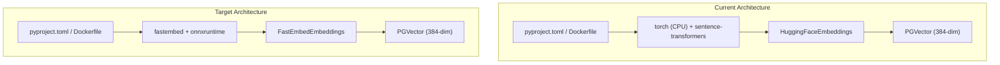

# Migration Plan: Switching from PyTorch & Sentence-Transformers to FastEmbed

## 1. Executive Summary

In MLOps Labs, all primary LLM reasoning (Mistral, WestAI, Groq) is handled remotely via external APIs. The local ML stack—specifically `torch`, `sentence-transformers`, and `langchain-huggingface`—is used solely to generate 384-dimensional text embeddings for the RAG long-term memory system (`all-MiniLM-L6-v2`) stored in PostgreSQL (`pgvector`).

Bundling PyTorch for this single task introduces substantial overhead:
- Massive container image bloat (~1.5 GB added).
- Slow cold start times and multi-second Python import latency.
- High memory consumption in containerized environments.

This document outlines the architectural plan to migrate from `torch` + `sentence-transformers` to **`fastembed`** (developed by Qdrant). `fastembed` runs the exact same `sentence-transformers/all-MiniLM-L6-v2` model using a lightweight ONNX Runtime execution engine on CPU, completely eliminating PyTorch.

---

## 2. Impact & Benchmark Comparison

| Metric | Current (`torch` + `sentence-transformers`) | Proposed (`fastembed`) | Expected Gain |
| :--- | :--- | :--- | :--- |
| **Docker Image Size** | ~2.5 GB – 3.0 GB | ~800 MB – 1.0 GB | **~65–70% reduction** |
| **PyTorch Dependency** | `torch` CPU wheel (~800 MB download) | None | **Completely eliminated** |
| **Python Import Latency** | ~2.5s – 4.0s (`import torch`, `transformers`) | ~0.15s – 0.3s | **~10x faster imports** |
| **Inference Engine** | PyTorch C++ / Python bindings | ONNX Runtime (C++) | **Lower memory footprint** |
| **Embedding Dimension** | 384 (`all-MiniLM-L6-v2`) | 384 (`all-MiniLM-L6-v2`) | **100% schema compatible** |
| **PostgreSQL / PGVector** | Fully compatible | Fully compatible | **No DB migration required** |

---

## 3. Affected Components & Architecture



### Affected Files
1. `game-api/pyproject.toml`: Remove `torch`, `sentence-transformers`, `langchain-huggingface`; add `fastembed`. Remove PyTorch extra index URL.
2. `game-api/Dockerfile`: Remove explicit `torch` CPU wheel installation step (`RUN uv pip install ... torch ...`).
3. `game-api/src/mlops_serious_game/config.py`: Update RAG embedding settings (deprecate `RAG_DEVICE`, optionally add `RAG_THREADS`).
4. `game-api/src/mlops_serious_game/application/rag/embeddings.py`: Replace `HuggingFaceEmbeddings` with `FastEmbedEmbeddings` from `langchain_community.embeddings.fastembed`.
5. `game-api/src/mlops_serious_game/application/rag/retrievers.py`: Update type annotations and factory calls to use `Embeddings` interface.
6. `game-api/src/mlops_serious_game/application/pitch_debate_service/tools.py`: Update retriever invocation to use new embedding provider.
7. `game-api/tools/create_long_term_memory.py` & `delete_long_term_memory.py`: Ensure CLI ingestion tools use the updated embeddings provider.

---

## 4. Step-by-Step Implementation Roadmap

### Phase 1: Dependency & Dockerfile Simplification
1. Update `game-api/pyproject.toml`:
   - Remove `torch` (and the `[tool.pip]` PyTorch CPU wheel extra-index URL).
   - Remove `sentence-transformers>=3.0.0`.
   - Remove `langchain-huggingface>=0.1.2`.
   - Add `fastembed>=0.4.0`.
2. Update `game-api/Dockerfile`:
   - Remove lines 11–12 (`RUN uv pip install --system torch ...`).
   - The dependencies will now install cleanly in a single `uv pip install` step without external index flags.

### Phase 2: Refactoring the Embedding Layer
1. **`embeddings.py`**:
   - Replace `from langchain_huggingface import HuggingFaceEmbeddings` with:
     ```python
     from langchain_community.embeddings.fastembed import FastEmbedEmbeddings
     ```
   - Implement `get_embedding_model(model_name: str, threads: int | None = None) -> FastEmbedEmbeddings`.
   - Maintain compatibility with `sentence-transformers/all-MiniLM-L6-v2` (FastEmbed supports this model directly, mapping to `sentence-transformers/all-MiniLM-L6-v2` or `fastembed`'s default alias).
2. **`retrievers.py`**:
   - Change type hint from `HuggingFaceEmbeddings` to standard `langchain_core.embeddings.Embeddings`.
   - Pass the `FastEmbedEmbeddings` instance into `PGVector(embeddings=..., ...)`.
3. **`config.py`**:
   - Retain `RAG_TEXT_EMBEDDING_MODEL_ID = "sentence-transformers/all-MiniLM-L6-v2"` and `RAG_TEXT_EMBEDDING_MODEL_DIM = 384`.
   - Replace or deprecate `RAG_DEVICE: str = "cpu"` with `RAG_THREADS: int | None = None` (allowing ONNX Runtime to manage thread parallelism efficiently).

### Phase 3: Runtime Tools & Ingestion Script Verification
1. Verify `tools.py` in `pitch_debate_service`:
   - Ensure `_get_vectorstore()` correctly initializes `FastEmbedEmbeddings`.
   - Test tool calling query: `retrieve_stakeholder_context`.
2. Verify `tools/create_long_term_memory.py`:
   - Ensure the ingestion pipeline runs end-to-end and writes 384-dimensional vectors to `stakeholder_long_term_memory` in PostgreSQL.

---

## 5. Detailed Code Changes & Diffs

### 5.1 `game-api/pyproject.toml`
```diff
 dependencies = [
     "fastapi[standard]>=0.115.8",
     "langchain-core>=0.3.34",
     "langchain-groq>=0.2.4",
     "langchain-openai>=0.1.0",
     "langchain-postgres>=0.0.12",
     "langgraph>=0.2.70",
     "langgraph-checkpoint-postgres>=2.0.0",
     "opik>=1.9.87",
     "pre-commit>=4.1.0",
     "pydantic-settings>=2.7.1",
     "sqlalchemy>=2.0.0",
     "alembic>=1.13.0",
     "psycopg[binary]>=3.1.0",
     "asyncpg>=0.29.0",
     "pgvector>=0.2.0",
     "loguru>=0.7.3",
-    "langchain-huggingface>=0.1.2",
     "langchain-community>=0.3.17",
+    "fastembed>=0.4.0",
     "wikipedia>=1.4.0",
     "ipykernel>=6.29.5",
     "pydantic>=2.10.6",
     "datasketch>=1.6.5",
-    "sentence-transformers>=3.0.0",
     "together>=1.3.0",
     "anthropic>=0.40.0",
     "httpx==0.27",
     "langchain>=0.3.0",
     "PyJWT>=2.8.0",
 ]

-[tool.pip]
-extra-index-url = "https://download.pytorch.org/whl/cpu/torch_stable.html"
```

### 5.2 `game-api/Dockerfile`
```diff
 # Install dependencies (cached unless pyproject.toml changes).
 COPY pyproject.toml README.md ./
-RUN --mount=type=cache,target=/root/.cache/uv \
-    uv pip install --system torch --index-url https://download.pytorch.org/whl/cpu
 RUN --mount=type=cache,target=/root/.cache/uv \
     uv pip install --system -r pyproject.toml
```

### 5.3 `game-api/src/mlops_serious_game/application/rag/embeddings.py`
```diff
-from langchain_huggingface import HuggingFaceEmbeddings
+from langchain_community.embeddings.fastembed import FastEmbedEmbeddings

-EmbeddingsModel = HuggingFaceEmbeddings
+EmbeddingsModel = FastEmbedEmbeddings


 def get_embedding_model(
     model_id: str,
-    device: str = "cuda",
+    threads: int | None = None,
 ) -> EmbeddingsModel:
     """Gets an instance of a HuggingFace embedding model.
 
     Args:
-        model_id (str): The ID/name of the HuggingFace embedding model to use
-        device (str): The compute device to run the model on (e.g. "cpu", "cuda").
-            Defaults to "cpu"
+        model_id (str): The ID/name of the embedding model to use.
+        threads (int | None): Number of threads for ONNX runtime inference.
 
     Returns:
-        EmbeddingsModel: A configured HuggingFace embeddings model instance
+        EmbeddingsModel: A configured FastEmbed embeddings model instance.
     """
-    return get_huggingface_embedding_model(model_id, device)
-
-
-def get_huggingface_embedding_model(
-    model_id: str, device: str
-) -> HuggingFaceEmbeddings:
-    return HuggingFaceEmbeddings(
-        model_name=model_id,
-        model_kwargs={"device": device, "trust_remote_code": True},
-        encode_kwargs={"normalize_embeddings": False},
-    )
+    return FastEmbedEmbeddings(
+        model_name=model_id,
+        threads=threads,
+    )
```

### 5.4 `game-api/src/mlops_serious_game/application/rag/retrievers.py`
```diff
-from langchain_huggingface import HuggingFaceEmbeddings
+from langchain_core.embeddings import Embeddings
 from langchain_postgres import PGVector
 from loguru import logger

 from mlops_serious_game.config import settings
 from .embeddings import get_embedding_model


-def get_vectorstore(embedding_model: HuggingFaceEmbeddings) -> PGVector:
+def get_vectorstore(embedding_model: Embeddings) -> PGVector:
     """Creates a PGVector vector store instance using PostgreSQL."""
     return PGVector(
         embeddings=embedding_model,
         collection_name=settings.POSTGRES_LONG_TERM_MEMORY_TABLE,
         connection=settings.POSTGRES_URI,
         use_jsonb=True,
     )
```

---

## 6. Risks & Mitigations

| Risk | Likelihood | Impact | Mitigation |
| :--- | :--- | :--- | :--- |
| **Embedding Numerical Drift** | Low | Low | FastEmbed uses the exact ONNX export of `sentence-transformers/all-MiniLM-L6-v2`. Semantic retrieval order remains virtually identical. After switching, run `tools/create_long_term_memory.py` once to re-sync all document embeddings. |
| **Model Weight Download on First Run** | Medium | Low | FastEmbed downloads the ONNX model (~80 MB) on first invocation to the local cache directory (`~/.fastembed_cache`). We can optionally pre-warm or bake this into the Docker image build stage to guarantee offline availability. |
| **Vector Dimension Mismatch** | Very Low | High | Both implementations produce identical 384-dimensional vectors, preserving full compatibility with `settings.RAG_TEXT_EMBEDDING_MODEL_DIM = 384` and PostgreSQL schema. |

---

## 7. Verification & Acceptance Criteria

1. **Local Build & Size Verification:**
   - Execute `docker compose build api`.
   - Confirm the resulting `game-api` image is reduced by > 1 GB.
2. **Import Speed Verification:**
   - Run `python -c "import mlops_serious_game.infrastructure.api"` inside the container; verify startup completes in < 1 second.
3. **Retrieval Verification:**
   - Execute `tools/create_long_term_memory.py` to embed sample stakeholder documents.
   - Run a test query via `retrieve_stakeholder_context` in `pitch_debate_service/tools.py` and verify relevant chunks are retrieved.
4. **End-to-End Game Flow:**
   - Start containers with `docker compose up -d`.
   - Initiate a stakeholder debate session in the frontend; ensure stakeholder responses retrieve context without errors.
